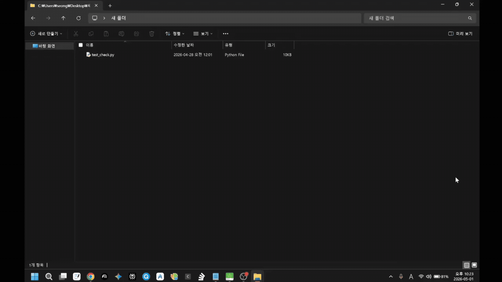

# Kunsan University Dormitory Auto Check

A browser automation system for the  
Kunsan National University Dormitory Daily Check.

This project automatically performs:

- Login
- Portal navigation
- MY MENU traversal
- Daily dormitory check submission
- Save button interaction
- Popup handling

using Playwright-based browser automation.

The system is specifically designed to handle:

- Nexacro-based portal structure
- iframe-heavy environments
- popup layers
- dynamic DOM rendering

inside the Kunsan University Integrated Information System.

---

# 🚨 IMPORTANT (Read First)

## Required Setup: Register "Daily Check" as Favorite

Before using this automation, you MUST register:

```text
Integrated Information System
→ Dormitory
→ Daily Check
→ ⭐ Add to Favorites
```

⚠️ If this is not configured, the automation will fail.

This project does NOT simply navigate via direct URLs.

Instead, it searches for the menu using:

- MY MENU
- Favorite menu structure
- personalized portal navigation

If favorites are not registered:

- menu traversal fails
- DOM path becomes inconsistent
- automatic clicking fails
- runtime cannot locate the page

You may remove the favorite afterward if desired.

---

# 🎥 Demo

```md

```

Recommended GIF scenes:

1. Login
2. Open integrated portal
3. Navigate to MY MENU
4. Open Daily Check
5. Click Save
6. Popup auto-confirmation
7. Success logs

---

# 🏗 System Architecture

```text
┌────────────────────┐
│   User Scheduler   │
│ (GitHub Actions /  │
│  Local Cron / iOS) │
└─────────┬──────────┘
          │
          ▼
┌────────────────────┐
│   Runtime Worker   │
│  (Execution Core)  │
└─────────┬──────────┘
          │
          ▼
┌────────────────────┐
│ Playwright Engine  │
│ Chromium Automation│
└─────────┬──────────┘
          │
          ▼
┌────────────────────┐
│ Kunsan Portal DOM  │
│ Nexacro Framework  │
└────────────────────┘
```

---

# ✨ Features

- Automatic login
- Integrated portal navigation
- New tab detection
- MY MENU traversal
- iframe support
- Popup auto-handling
- Save button automation
- Duplicate login handling
- Runtime fallback strategies
- Runtime logging
- Scriptable(iOS) support

---

# 🤔 Why Playwright?

## Why Playwright Instead of Selenium?

The Kunsan University portal contains:

- dynamic DOM rendering
- iframe-heavy structure
- Nexacro UI runtime
- popup layers
- async event systems
- multiple tab transitions

which makes it significantly more complex than a normal website.

Playwright was selected because it provides:

| Reason | Description |
|---|---|
| Strong async architecture | asyncio-native |
| Stable tab detection | context.expect_page() |
| Excellent iframe support | easy frame traversal |
| Chromium-level control | realistic browser behavior |
| Auto-wait system | stable DOM synchronization |
| Modern locator API | resilient selector strategy |

Especially for Nexacro-based systems:

```python
locator()
wait_for()
expect_page()
frame traversal
```

style automation becomes extremely important.

---

# 🔍 DOM Traversal Strategy

## DOM Navigation Strategy

This project is NOT simple CSS selector automation.

The portal contains:

- nested iframes
- dynamically generated buttons
- popup layers
- delayed DOM rendering
- Nexacro event systems

Therefore, the runtime uses multiple fallback strategies.

---

## Primary Traversal

```python
locator("button:has-text('Save')")
```

Fast standard DOM traversal.

---

## Secondary Traversal

```python
frame.get_by_role("button", name="Save")
```

iframe-based traversal.

---

## Third Traversal

```python
keyboard.press("Enter")
```

Popup focus fallback strategy.

---

## Final Recovery Traversal

```python
Traverse all frames
→ scan all buttons
→ text-based fallback matching
```

Ultimate recovery mechanism.

---

This architecture allows the runtime to survive:

- selector changes
- iframe structure changes
- popup changes
- Nexacro rendering inconsistencies

without immediate total failure.

---

# 🧠 Runtime Skeleton Architecture

## Runtime Lifecycle

This project is designed as a:

```text
Runtime Execution Pipeline
```

rather than a simple automation script.

```text
Task Definition
    ↓
Browser Runtime
    ↓
Authentication
    ↓
Portal Navigation
    ↓
DOM Discovery
    ↓
Action Execution
    ↓
Popup Resolution
    ↓
Result Validation
    ↓
Logging & Exit
```

Each stage handles failure independently.

This allows:

- login recovery
- popup recovery
- DOM fallback traversal
- frame recovery
- runtime diagnostics

without immediately crashing the system.

---

# ⚠ Nexacro Compatibility Layer

The Kunsan University portal uses:

```text
Nexacro Runtime
```

which behaves differently from modern standard websites.

Common issues include:

- synthetic click rejection
- iframe isolation
- event trust validation
- TouchEvent conflicts
- dynamic popup rendering

To solve this, the iOS/Scriptable version uses:

- MouseEvent injection
- TouchEvent propagation
- parent bubbling
- forced event dispatch
- traversal recovery

strategies.

---

# 📂 Project Structure

```bash
.
├── .github/
│   └── workflows/
│       ├── main.txt
│       └── main.yml
│
├── main.py
├── requirements.txt
├── README.md
├── LICENSE
│
├── docs/
│   ├── demo.gif
│   ├── architecture.png
│   ├── runtime.png
│   ├── flowchart.png
│   └── screenshots/
│
└── logs/
```

---

# ⚙ Installation

## 1. Clone Repository

```bash
git clone https://github.com/autocheckfromkunsan-art/Kunsan-University-Dormitory-auto-check.git
```

---

## 2. Enter Directory

```bash
cd Kunsan-University-Dormitory-auto-check
```

---

# 🐍 Install Python

Download Python:

 [oai_citation:0‡python.org](https://www.python.org/downloads/?utm_source=chatgpt.com)

During installation:

```text
✔ Add Python to PATH
```

must be enabled.

---

# 📦 Install Playwright

```bash
pip install playwright
```

---

# 🌐 Install Chromium

```bash
playwright install chromium
```

If errors occur:

```bash
python -m playwright install chromium
```

---

# 🔐 GitHub Actions Secrets Setup (VERY IMPORTANT)

To run the automation on GitHub Actions,  
you MUST register your credentials as GitHub Repository Secrets.

Without this:

- login fails
- USER_ID becomes None
- USER_PW becomes None
- workflow execution fails

---

# 📍 Navigation Path

Inside your GitHub repository:

```text
Settings
→ Security and quality
→ Secrets and variables
→ Actions
```

---

# ➕ Register USER_ID

## Step 1

Click:

```text
New repository secret
```

---

## Step 2

Enter:

### Name

```text
USER_ID
```

### Secret

```text
Your student ID
```

---

# ➕ Register USER_PW

Again click:

```text
New repository secret
```

---

## Name

```text
USER_PW
```

---

## Secret

```text
Your portal password
```

---

# ⚠ Never Hardcode Credentials

❌ Bad example:

```python
user_id = "20201234"
user_pw = "mypassword"
```

This may expose credentials publicly.

---

# ✅ Correct Secure Method

```python
import os

user_id = os.environ.get("USER_ID")
user_pw = os.environ.get("USER_PW")
```

Secrets are securely injected during runtime.

---

# ⚙ GitHub Actions Activation (VERY IMPORTANT)

The repository intentionally stores the workflow as:

```text
main.txt
```

instead of:

```text
main.yml
```

because GitHub only recognizes:

```text
.yml
```

files as executable workflows.

---

# 📍 Workflow File Location

```text
.github
→ workflows
→ main.txt
```

---

# 🖱 How to Open main.txt

## 1. Open Repository

 [oai_citation:1‡github.com](https://github.com/autocheckfromkunsan-art/Kunsan-University-Dormitory-auto-check?utm_source=chatgpt.com)

---

## 2. Open `.github`

Click:

```text
.github
```

---

## 3. Open `workflows`

Click:

```text
workflows
```

---

## 4. Open `main.txt`

Click:

```text
main.txt
```

---

# ✏ Enter Edit Mode

Click the:

```text
✏ Edit this file
```

button.

Or click the pencil icon.

---

# 📝 Rename File Extension

At the top of the editor:

```text
main.txt
```

Change:

```text
.txt
```

to:

```text
.yml
```

Final result:

✅ Correct

```text
main.yml
```

---

# 📌 Why Must It Be .yml?

GitHub Actions ONLY recognizes:

```text
.github/workflows/*.yml
```

or:

```text
.github/workflows/*.yaml
```

files.

| Filename | Works? |
|---|---|
| main.txt | ❌ |
| main.py | ❌ |
| main.yml | ✅ |

---

# 💾 Save Changes

Click:

```text
Commit changes...
```

---

## Commit Message Example

```text
Rename workflow to yml
```

Then click:

```text
Commit changes
```

again.

---

# ✅ After Successful Activation

You will now have:

- Actions tab enabled
- automatic scheduled execution
- manual workflow execution
- GitHub workflow recognition

---

# 🚀 Verify Workflow

Open:

```text
Actions
```

tab at the top of GitHub.

You should now see:

```text
Kunsan Daily Check
```

workflow.

---

# ▶ Manual Workflow Execution

Inside the Actions tab:

```text
Run workflow
```

button becomes available.

---

# ⚠ If Workflow Does Not Appear

Common causes:

| Cause | Solution |
|---|---|
| Still .txt | Rename to .yml |
| Wrong folder | Use .github/workflows |
| Not committed | Commit changes |
| YAML syntax issue | Fix indentation |

---

# 🧠 Why Is It Initially .txt?

GitHub automatically activates workflow files.

To prevent:

- accidental execution
- unintended automation
- beginner mistakes
- unauthorized runtime activation

the workflow is intentionally shipped as:

```text
main.txt
```

---

# 🚀 Usage

## Run Locally

```bash
python main.py
```

---

# ⚙ GitHub Actions Workflow Example

`.github/workflows/main.yml`

```yaml
name: Kunsan Daily Check

on:
  schedule:
    - cron: '17 23 * * *'

  workflow_dispatch:

jobs:
  check:
    runs-on: ubuntu-latest

    steps:
      - name: Checkout Repository
        uses: actions/checkout@v4

      - name: Set up Python
        uses: actions/setup-python@v5
        with:
          python-version: '3.11'

      - name: Install Dependencies
        run: |
          pip install playwright
          playwright install chromium

      - name: Run Script
        env:
          USER_ID: ${{ secrets.USER_ID }}
          USER_PW: ${{ secrets.USER_PW }}
        run: python main.py
```

---

# 🔄 Runtime Flow

```text
1. Open Login Page
2. Authenticate User
3. Handle Duplicate Login Popup
4. Open Integrated Portal
5. Detect New Tab
6. Navigate Student Service
7. Open MY MENU
8. Open Daily Check
9. Click Save
10. Resolve Popup
11. Validate Success
12. Exit Runtime
```

---

# 📱 iOS / Scriptable Support

This project also supports iOS automation through Scriptable.

Features include:

- WKWebView automation
- TouchEvent injection
- Multi-frame traversal
- Synthetic click override

---

# ⚠ Warning

This project was created for:

- learning purposes
- browser automation research
- repetitive task automation

Users should consider:

- university policies
- portal terms of service
- account security

before usage.

Abusive or excessive requests may impact the service.

---

# 🛣 Roadmap

- [ ] Docker support
- [ ] GitHub Actions Scheduler
- [ ] Telegram notifications
- [ ] Discord webhook
- [ ] OCR-based button traversal
- [ ] AI DOM recovery
- [ ] Runtime monitoring
- [ ] Headless cloud runtime
- [ ] Multi-account support
- [ ] Auto retry queue

---

# 📸 Recommended Assets

```text
docs/
├── demo.gif
├── architecture.png
├── runtime.png
├── flowchart.png
└── screenshots/
```

---

# 📖 Technical Notes

The Kunsan University portal differs significantly from a modern SPA.

It uses:

- Nexacro Runtime
- iframe-heavy rendering
- dynamic popup systems
- non-standard event flows

Therefore, this project prioritizes:

- runtime state tracking
- DOM recovery
- popup fallback strategies
- frame traversal resilience

instead of traditional Selenium-style automation.

---

# 👨‍💻 Author

Developed by

 [oai_citation:2‡github.com](https://github.com/seongbin45)

---

# 📄 License

MIT License
